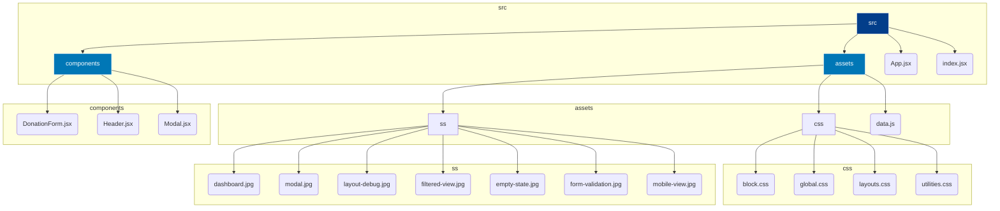

# Donation Inventory Manager

A simple and elegant web application built with React to track and manage various types of donations. The app provides a clean interface for viewing, adding, editing, and deleting donation records.

## Screenshots

| Main Dashboard View | Add/Edit Donation Modal |
| :---: | :---: |
|  |  |

| Responsive Layout Handling | Filtered View |
| :---: | :---: |
|  |  |

| Form Validation Error | Empty State |
| :---: | :---: |
|  |  |

**Mobile Responsive View**


## Features

-   **CRUD Operations:** Full capabilities to Create, Read, Update, and Delete donation entries.
-   **Modal Form:** A reusable modal component for adding and editing donations without leaving the main page.
-   **Dynamic Filtering:** Filter the displayed donations by type (e.g., Money, Food, Clothing).
-   **Responsive Design:** Built with a modern, custom CSS layout system that ensures the application looks great on all screen sizes.
-   **Component-Based Architecture:** Logically structured with reusable React components for maintainability.

## Tech Stack

-   **React:** A JavaScript library for building user interfaces.
-   **Modern CSS:** Custom CSS properties (variables), fluid typography/spacing with `clamp()`, and a logical layout system.

## Getting Started

To get a local copy up and running, follow these simple steps.

### Prerequisites

You need to have [Node.js](https://nodejs.org/) (which includes npm) installed on your machine.

### Installation

1.  **Clone the repository** to your local machine:
    ```sh
    git clone [https://your-repository-url.com](https://your-repository-url.com)
    ```
2.  **Navigate into the project directory:**
    ```sh
    cd donation-inventory-manager
    ```
3.  **Install the required dependencies:**
    ```sh
    npm install
    ```

### Running the Application

1.  **Start the development server:**
    ```sh
    npm run dev
    ```
2.  Open your browser and navigate to `http://localhost:5173` to see the application running.

## Screenshots
### Add Donation Records

### Edit Donation

### Form Quantity error

### Ipad

### Iphone 12 pro

### Iphone 6

### MacBook 20 pro


## Project Structure

The project follows a standard React application structure, with a clear separation of concerns.



### Key Components

-   **`App.jsx`**: The core component that manages the application's state, including the list of donations, filter settings, and modal visibility. It passes data and functions down to child components.
-   **`DonationForm.jsx`**: A controlled form component that can be used for both creating a new donation and editing an existing one. It receives an `initialData` prop to populate fields for editing.
-   **`Modal.jsx`**: A generic modal component that overlays the screen. It can be closed by clicking the background overlay, the close button, or by pressing the `Escape` key.

### CSS Methodology

The project uses a powerful, custom CSS system that avoids the need for large frameworks by adopting modern methodologies:

-   **[CUBE CSS](https://cube.fyi/):** The overall structure follows the CUBE (Composition, Utility, Block, Exception) methodology. This approach prioritizes simple, composable CSS rules over complex, monolithic components.
    -   **`global.css`**: This is the foundation. It defines design tokens (colors, fonts, spacing) as CSS custom properties.
    -   **`layouts.css`**: Contains reusable, low-level layout primitives (Composition).
    -   **`utilities.css`**: Contains simple utility classes (Utility).
    -   **`block.css`**: Contains styles for specific, reusable components (Block).

-   **[Utopia](https://utopia.fyi/):** All typography and spacing are fluid and responsive, generated using Utopia. This tool creates `clamp()` functions that allow font sizes and margins to scale smoothly between a minimum and maximum viewport size, eliminating the need for traditional media query breakpoints for typography.

This structure makes the styling highly modular, consistent, and resilient to change.
